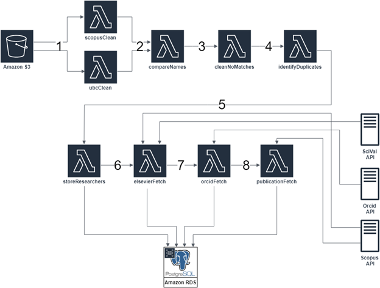
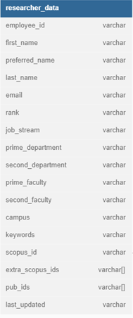
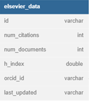
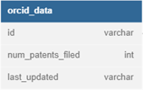
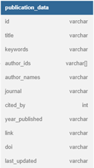

# Data Pipeline Deep Dive

The goal of the data pipeline is to initially populate the database and add data on new researchers. 

Prior to running the pipeline two files have to be uploaded to the S3 bucket (More info on this process can be found in step 5 of the Deployment Guide or under the Data Update section of the User Guide): 
1. A file containing researcher HR data. The file must be formatted like the following file: [Example HR Data File](example_data/hr_data(example).csv)
2. A file of Scopus ids for researchers affiliated with the institution. This file can be obtained from SciVal as outlined in step 5 of the Deployment Guide and under the Data Update section of the User Guide.
(Optional) A file of manually matched HR data and Scopus ids. The file must be formatted like the following file: [Example Matches File](example_data/manual_matches(example).csv)

## 1. Data Cleaning
Raw Scopus and HR data stored in comma separated values (CSV) files is fetched from an Amazon S3 bucket. Both datasets are cleaned which involves standardizing the names present in both datasets by removing all spaces, special characters, and setting all characters to lowercase. The results are then stored as CSV files within the S3 bucket. This step ensures that both datasets are formatted the same for step 2.

## 2. Name Matching
The standardized names are compared in order to match Scopus Ids to Institution's HR data. This process uses a string metric called Jaro-Winkler distance in order to determine if two names are the same. A researcher’s last name is compared first then the Jaro-Winkler distance of the first name is checked for each last name match. This order was chosen because researchers often shorten their first name which makes it less reliable when matching.
### 2.1 Jaro-Winkler Distance
Jaro-Winkler distance is a metric for measuring string similarity which gives preference to strings that match from the beginning of the string. The score is normalized to be between 0 and 1 with a score of 1 representing an exact match and a score of 0 representing a lack of any similarity. For example “Puffins” and “Muffins” have a Jaro-Winkler distance of 0.90 whereas “Puffins” and “Puffing” have a distance of 0.94. Note that each pair of words are the same except for one letter though the second set of words has a higher score because the beginning of the strings match.
### 2.2 Sorting Matches
Scopus id matches that have a Jaro-Winkler distance greater than or equal to 0.95 are considered correct matches. Matches that have a distance lower than 0.95 are considered uncertain matches and are analyzed further in step 3. When multiple Scopus ids are matched to a single name and they all have a distance that is greater or equal to 0.95 then these matches are considered duplicate matches and are analyzed further in step 4.

## 3. Analyzing Uncertain Matches
The matches that failed to meet the Jaro-Winkler distance threshold are further processed by comparing data obtained from Scopus to the HR data. First matches with a Jaro-Winkler distance that is less than 0.90 are removed since their score is low enough that it can be assumed that there is no match. These matches are removed because the Jaro-Winkler distance is too low for the names to actually be a match and if every potential match were to be processed in this step then the weekly Scopus API quota would be exceeded. Next there is a comparison between the researchers department and subject area data from Scopus. If the match still isn’t certain then there is a comparison between the researchers name and name variants present on Scopus. If there is no match for department info or name variants then the match is stored in a file called `no_matches_clean.csv` so that it can be manually verified if needed. The comparison against name variants on Scopus is left to the end since many researchers do not have name variants present on their profile and it was found that comparing subject area data first was more effective. 

## 4. Analyzing Duplicate Matches
The researchers that have been matched to more than one Scopus Id are processed further in a similar way as the uncertain matches in step 3. First there is a comparison between department and subject area data obtained from Scopus. If one of the potential matches is found to match the subject areas while the others do not then that match is stored in a CSV file. If one match is not more certain from the others then the Scopus id with the highest h-index is considered the primary id while the other ids are attached to the profile as “extra ids”.
### 4.1 Extra Scopus Ids
Some researchers have multiple Scopus ids attributed to them due to how Scopus attributes data to researchers. Scopus ids are system generated and therefore if a researcher publishes under different name variations or the researcher has published with different university affiliations then there is a chance they will have multiple Scopus ids. In order to present the most relevant data the Scopus id with the highest 5-year h-index is chosen as the id whose data is displayed on the innovation dashboard.

## 5. Storing Matched Data
Researchers whose Scopus id’s were identified in steps 2-4 have their data stored in the “researcher_data” table of the PostgreSQL database. Researchers who were found to have multiple scopus ids have their extra ids stored in the database as well. Any data where Scopus id’s were manually matched to a researcher's data are also stored in the database at this point.

### 5.1 Researcher Data Table Schema

| Column Name | Description | Source |
| ----------- | ----------- | ----------- |
| employee_id | The researchers employee id | S3 (.csv file) |
| first_name | First name of researcher | S3 (.csv file) |
| preferred_name | Preferred name of researcher | S3 (.csv file) |
| last_name | Last name of researcher | S3 (.csv file) |
| email | Email address | S3 (.csv file) |
| rank | The researcher’s academic rank (ex: Professor) | S3 (.csv file) |
| job_stream | The researcher’s academic track type (ex: Tenure) | S3 (.csv file) |
| prime_department | The researcher’s primary department affiliation (ex: Mechanical Engineering) | S3 (.csv file) |
| second_department | The researcher’s secondary department affiliation | S3 (.csv file) |
| prime_faculty | The researcher’s primary faculty affiliation (ex: Faculty of Science) | S3 (.csv file) |
| second_faculty | The researcher’s secondary faculty affiliation | S3 (.csv file) |
| campus | The campus the researcher is located at (ex: UBC Okanagan Campus) | S3 (.csv file) |
| keywords | A list of keywords taken from the researcher’s publications | Scopus (API) |
| scopus_id | The researcher’s Scopus id | SciVal (.csv file) |
| extra_scopus_ids | A researchers extra Scopus ids | SciVal (.csv file) |
| pub_ids | A list of the Scopus ids of a researchers publications | Scopus (API) |
| last_updated | A unix timestamp for when the table was last updated | N/A |

## 6. Fetching Researcher Data from Elsevier
For each researcher in the database, metrics are fetched from the SciVal and Scopus APIs. Number of documents, number of citations, and ORCID ID are obtained from Scopus and a 5-year h-index is obtained from SciVal. If a researcher does not have an ORCID profile their ORCID id is set to 0. This data is stored in the database.
## 6.1 Elsevier Data Table Schema

| Column Name | Description | Source |
| ----------- | ----------- | ----------- |
| id | The researcher’s Scopus id | SciVal (.csv file) |
| num_citations | Number of documents that cite this researcher | Scopus (API) |
| num_documents | Number of documents authored by the researcher | Scopus (API) |
| h_index | The h-index of the researcher | Scival (API) |
| orcid_id | The researcher’s ORCID id | Scopus (API) |
| last_updated | A unix timestamp for when the table was last updated | N/A |

## 7. Fetching Patent Data from ORCID
The number of filed patents listed on ORCID is fetched from the ORCID API and stored in the database. If an ORCID id could not be obtained from the Scopus API in step 6 then the researcher's number of filed patents is set to 0.
### 7.1 ORCID Data Table Schema

| Column Name | Description | Source |
| ----------- | ----------- | ----------- |
| id | The researcher’s ORCID id | Scopus (API) |
| num_patents_filed | The number of patents listed on the researcher’s ORCID profile | ORCID (API) |
| last_updated | A unix timestamp for when the table was last updated | N/A |

## 8. Fetching Publication Data from Scopus
Each researcher's publication data is fetched from the Scopus API and stored in the database. This data includes each publication’s title, when the publication was published, associated keywords, author names and Scopus ids, journal title, and the number of times the publication has been cited. Additionally a url is stored with each publication which a user can use to access a publications full Scopus page. During this step a researcher's publication ids and publication keywords are added to the “researcher_data” table which was described in step 5.
### 8.1 Publication Data Table Schema

| Column Name | Description | Source |
| ----------- | ----------- | ----------- |
| id | The Scopus id of the publication | Scopus (API) |
| title | The title of the publication | Scopus (API) |
| keywords | The keywords associated with the publication | Scopus (API) |
| author_ids | The Scopus ids of the authors of the publication | Scopus (API) |
| author_names | The names of the authors of the publication | Scopus (API) |
| journal | The journal the publication was published in | Scopus (API) |
| cited_by | The amount of times the publication has been cited | Scopus (API) |
| year_published | The year the publication was published | Scopus (API) |
| link | A url for the publication’s Scopus page | Scopus (API) |
| doi (digital object identifier) | A persistent identifier used to uniquely identify publications. Standardized across different sources | Scopus (API) |
| last_updated | A unix timestamp for when the table was last updated | N/A |

## 9. Start Replication

The start replication Lambda will start the DMS replication task to replicate data from the PostgreSQL database to AWS Opensearch cluster to make the data searchable on the webapp.
