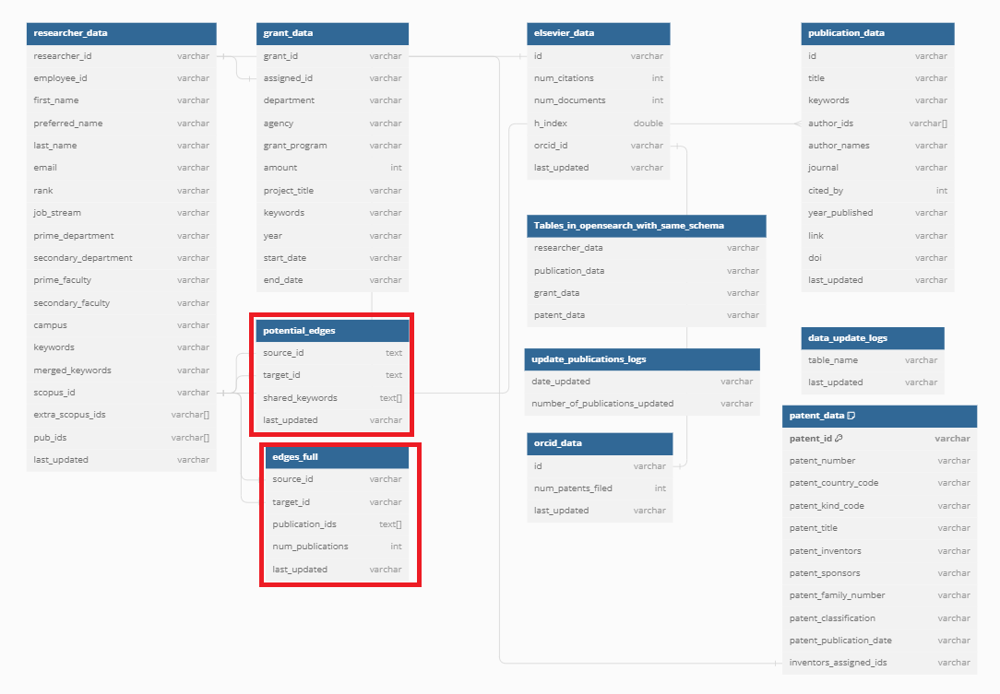

# Knowledge Graph Data Pipeline Deep Dive

The goal of the Knowledge Graph Pipeline is to populate the database with data that can be used to generate a visual graph of researchers' connections.

## 1. Knowledge Graph Tables Schema

### `edges_full` table

| Column Name | Description 
| ----------- | ----------- 
| source_id | The scopus id of the source researcher
| target_id | The scopus id of the target researcher
| publication_ids | The ids of the publications that the two researchers share
| num_publications | The number of publications that are shared between the two researchers
| last_updated | A unix timestamp for when the table was last updated

### `potential_edges` table

| Column Name | Description 
| ----------- | ----------- 
| source_id | The scopus id of the source researcher
| target_id | The scopus id of the target researcher
| shared_keywords | The keywords that the two researchers share
| last_updated | A unix timestamp for when the table was last updated