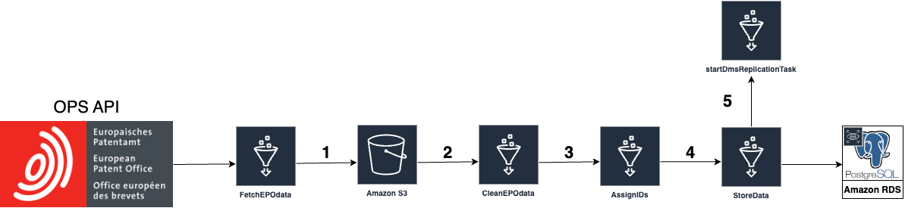
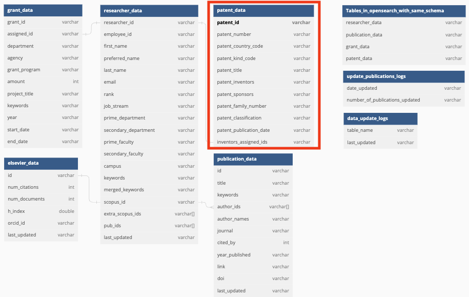

# Grant Data Pipeline Deep Dive

The goal of the Patent Data Pipeline is to initially populate the database with patent data. The data is fetched from the [European Patent Office](https://www.epo.org/), which contains both published patent application and published patent of not just European countries but also other major intellectual property offices (click [here](https://www.epo.org/searching-for-patents/data/coverage.html) for further details about EPO's published data coverage). EPO provides both a web search engine for patent called [Espacenet](https://worldwide.espacenet.com/patent/) and an Application Programming Interface (API) called [Open Patent Services](https://www.epo.org/searching-for-patents/data/web-services/ops.html) (OPS). The API is useful in particular because it allows for an easy programmatic access and retrieval of patent data from EPO, which is why we chose it to be our "one-stop shop" for patent data.

To use the OPS API, the user should obtain a developer account and with that, generate a consumer key and consumer secret key that serve as authorization credentials for the application. Up-to-date detail about the OPS API and how to sign up for an account can be found [here](https://developers.epo.org/).

Currently, the data that we are interested in obtaining for this current iteration of the Patent pipeline is all published patent data from Canada and The United States. For instruction on how to deploy and run the pipeline, consult this [deployment guide](DeploymentGuide.md).

This document aims to show exactly how the data processing steps works.

## 1. Data fetching

This step fetches raw data from the API and stores it inside an S3 bucket as a CSV. This is achieved by making a GET request to the specific API endpoint that returns bibliographic data for patent publications. The query will return all patent publications from the year 2001 up to the date on which the patent pipeline is invoked. Patent publication data includes both patent application documents (kind code A1, A2) and patent documents (kind code B1, B2, C) for both Canada (country code CA) and the United States (country code US).

### Bulk fetching

When fetching bulk data with the API, if your query contains more than 100 results, it will only maximum 100 results at a time. For example, if there are only 150 total results, the API will only return result from index 1-100.

To overcome this, we designed it to first get the total count of results, then create a loop that increase the index fetching by 100. For example, with 150 total results, it will first fetch from index 1-100, then index 101-200. Since there are only 150 results, it will only fetch up to 150. Index 151-200 does not contain any data, so the api will truncate the those indexes to 150.

### Scheduled runs

Since this is the first step in the patent pipeline that will invoke other steps downstream, it is scheduled to be run at 7:00 AM UTC on the 1st and 15th of every month (twice a month) with this cron expression: `0 7 1,15 * ? *`.

### pandas

This data pipeline uses Python [pandas](https://pandas.pydata.org/docs/) framework heavily for tabular manipulation.

## 2. Data normalization (cleaning)

This step will get the raw data from S3 and perform the necessary cleaning steps. Data processing steps include: eliminating special characters, trimming white spaces, and modifying the date format. Additionally, inventors' names will be capitalized and split into first and last names for further processing downstream.

## 3. Fuzzy name-matching and assigning ids
With the first and last names separated, this step will match the names with the researcher names in the RDS PostgreSQL database. This process uses a string metric called Jaro-Winkler distance to determine if two names are the same. The match that has the highest Jaro-Winkler distance is considered to be the closest match:
* If the Jaro-Winkler distance is above a certain threshold, the match is considered final and the name will be assigned a unique ID associated with that researcher from the PostgreSQL database.
* After each CSV file has the IDs assigned, every First and Last name pair will be recombined into a single name.

### Jaro-Winkler Distance

A string metric called Jaro-Winkler distance was used to determine if two name strings are the same. An inventor’s last name is compared first then the Jaro-Winkler distance of the first name is checked for each last name match. This order was chosen because researchers often shorten their first names which make it less reliable when matching. The whole idea of fuzzy name matching is that: Say in the database there is a researcher name Michael Doe, and on a particular patent entry there is an inventor name Mike Doe, then the Jaro-Winkler distance will tell us how likely it is that these two names belong to the same actual person. Currently, the threshold is set at 0.95 (Jaro-Winkler goes from 0 - 1). When a match is found, it also includes the person's IDs from our database with that result, hence the "assigning IDs". This is currently the best we could do since we do not have any other personally-identifiable info to compare with data from our database.

## 4. Storing data to PostgreSQL database
After each patent entry is name-matched, this step will insert the processed patent data into the RDS PostgreSQL under the patent_data table. Only patents with at least one matched researcher as an inventor will be inserted into the database.

### 4.1 Patent deduplication
Due to the way the GET query is structured, whenever the pipeline is invoked, all data published from 2001 up to the current date will be retrieved. This can cause duplicated insertion. Thus, we implemented a de-dup mechanism like so:
1. Fetch all current rows in the `patent_data` table before inserting
2. Aggregate both new data and old data together in the same [pandas DataFrame](https://pandas.pydata.org/docs/reference/api/pandas.DataFrame.html) with  [pd.concat()](https://pandas.pydata.org/docs/reference/api/pandas.concat.html)
3. Drop rows that contains duplicated patent_number, patent_family_number and patent_publication_date with [df.drop_duplicates()](https://pandas.pydata.org/docs/reference/api/pandas.DataFrame.drop_duplicates.html).
4. Only inserting the rows that are NOT dropped, which means they are new entries and are unique.

## 5. DMS Replication Task and OpenSearch Service
This step will start a data Replication Task on AWS Data Migration Service (DMS) to replicate the new patent data into AWS Opensearch Service. After this process is done, the data will be searchable on the front-end web app.

### Relational Table Update in the PostgreSQL Database

For this new implementation to work, a new `patent_data` table is created

### 5.2 `patent_data` table

| Column Name | Description | Source |
| ----------- | ----------- | ------ |
| patent_id | the **unique ID** associated with each patent record | generated internally by the PostgreSQL Database Engine |
| patent_number | the publication number of a patent/patent application | OPS API |
patent_country_code | the country code of a patent/patent application, for now either CA or US | OPS API |
patent_kind_code | the kind code of the published patent/patent application. A1, A2 represents a published patent application, and B1, B2 (C for Canada) represents the published patent. | OPS API |
| patent_title | the title of the invention | OPS API |
patent_inventors | the inventors of the invention | OPS API |
patent_sponsors | the entities who applied for the patent, usually an agency, university, company, or sometimes the inventors themselves | OPS API |
| patent_family_number | the family number of the published patent/application, indicate patent publications that belongs to the same "invention" | OPS API |
| patent_classification | the classification codes of a patent, indicate which industrial fields the invention is relevant to | OPS API |
| patent_publication_date | the date which the patent/patent application is published | OPS API |
inventors_assigned_ids | the ids of the inventors names that was successfully matched with existing researcher names in PostgreSQL database | OPS API |