# User Guide

**Before Continuing with this User Guide, please make sure you have deployed the frontend and backend stacks.**

- [Deployment Guides](./DeploymentGuide.md)

| Index                                        | Description                                           |
| :------------------------------------------  | :---------------------------------------------------- |
| [Home](#Home)                                | Main search bar (Search Everything)                   |
| [Researchers Search](#Researchers-Search)    | Researcher search and related filters                 |
| [Publications Search](#Publications-Search)  | Publications search                                   |
| [Grants Search](#Grants-Search)                     | Grants search and related filters                     |
| [Patents Search](#Patents-Search)                   | Patents search and related filters                    |
| [Advanced Search](#Advanced-Search)          | Advanced search                                       |
| [Researcher Profile](#Researcher-Profile)    | Researcher profile and information page               |
| [Impact](#Impact)                            | Researcher impact by department or faculty            |
| [Metrics](#Metrics)                          | Top 100 research keywords word cloud                  |
| [Admin Dashboard](#Admin-Dashboard)          | Update logs, Changing Scopus IDs, Viewing Flagged IDs |
| [Updating Researchers](#Updating-Researchers)| Process for Updating Researcher Data                  |
| [Updating Grant Data](#updating-grant-data)  | Process for Updating Grant Data                       |
| [Updating Patent Data](#updating-patent-data)| Process for Updating Patent Data                      |

**Note:** The screenshots contained in this User Guide show some information as redacted to obscure data that is not fully up to date.
 

## Home

The Home page shows the four types of content ([Researchers](#Researchers-Search), [Publications](#Publications-Search), [Grants](#grants-search) and [Patents](#patents-search)) you can find in the dashboard. Clicking on the icon will open the search page for the type of information you want to find.

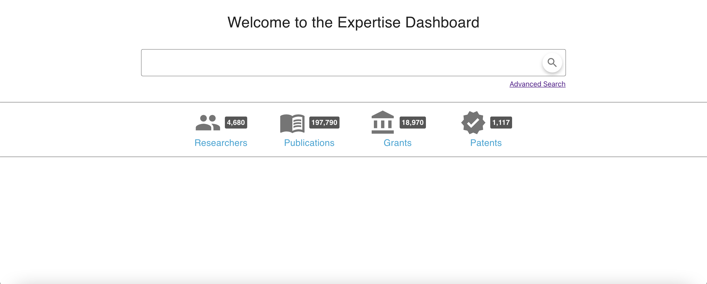

#### NOTE: "Institution" in this document refers to the institution that deploys this solution.

## Researchers Search

The search bar on this page returns researcher results that match the user inputted search term. Researchers that are adjunct professors will have a `*` character beside their name. Filters for researchers can be found on the left hand sidebar. There are 2 categories to filter by (Department, Faculty). The number of selected categories will appear next to the option.

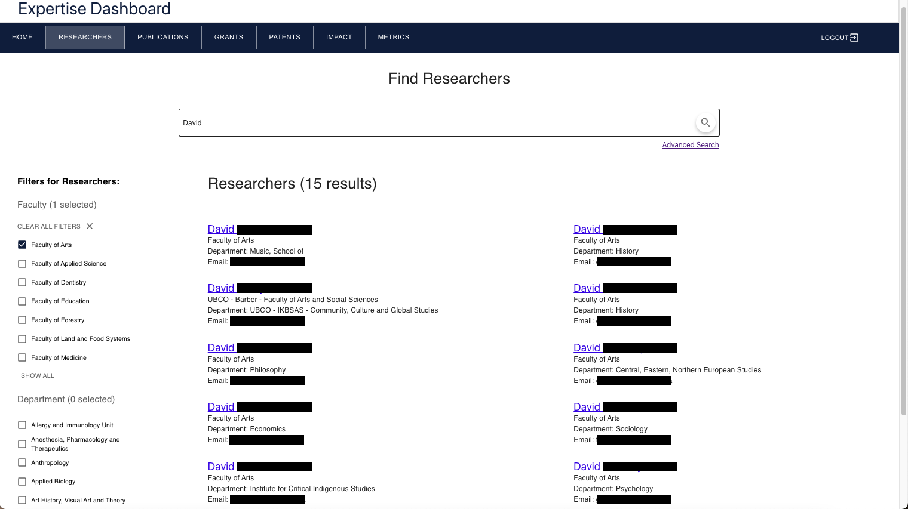

Clicking on the `Show All` button will open a window displaying all the possible options for the filter category. To select the options you would like to filter by, click the checkbox beside the option name. Then click `Apply Filters`. Multiple filter options can be selected from both the Department and Faculty categories. Selected options will appear on the left hand sidebar. The number of results returned will show up on the top next to the word ‘Researchers’.

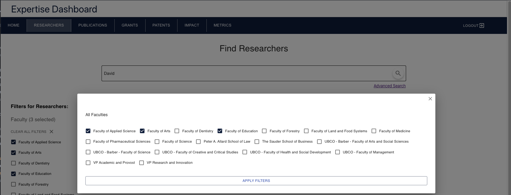

## Publications Search

The search bar on this page returns publication results that match the user inputted search term. Click on the publication title to be redirected to corresponding entry on Scopus website.

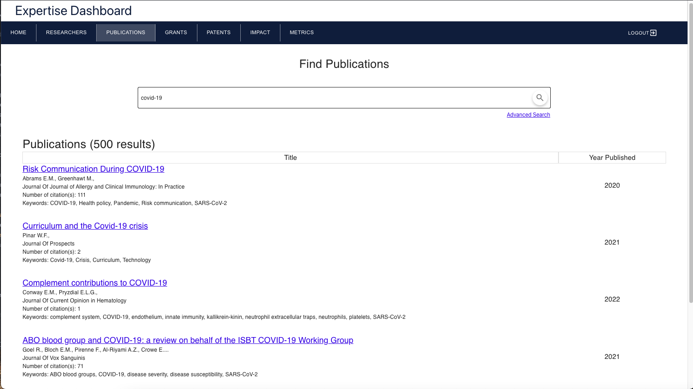

## Grants Search

The search bar on this page returns grant results that match the user inputted search term. The filter for grants can be found on the left hand side bar. There are four funding agencies to filter by. To select the grant options you would like to filter by, click the checkbox beside the option name to initiate the filter function.

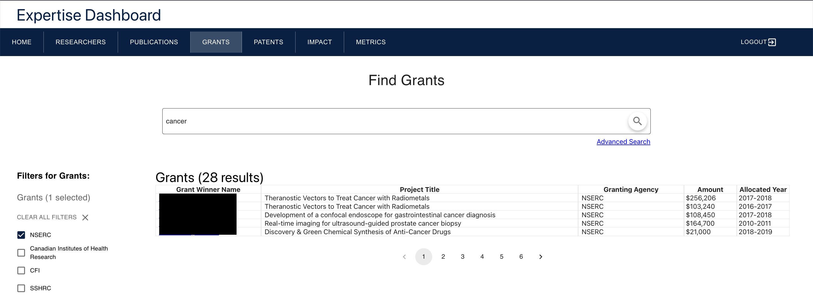

## Patents Search

The search bar on this page returns patent results that match the user inputted search term. The filter for patents can be found on the left hand sidebar. There are nine categories to filter by.

Hovering over the `(i)` icon next to Patent Classification filter will show the types of patents one can expect to find when selecting a category.

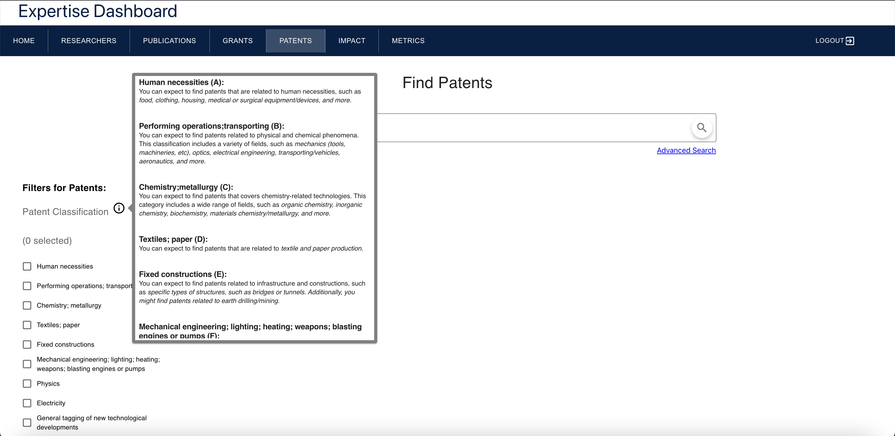
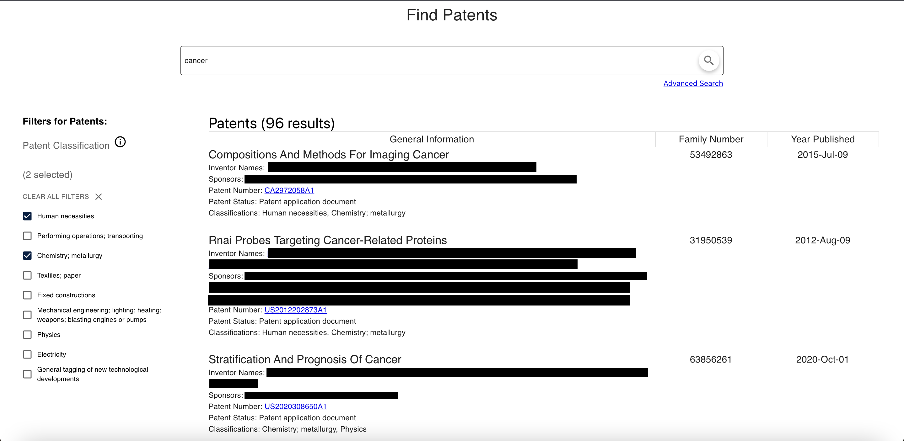

## Advanced Search

The advanced search page offers a more detailed method of finding information on the website, and increases search accuracy by allowing users to specify additional requirements for a search.

The advanced search page can be accessed by clicking the `Advanced Search` button underneath the search bar in Researchers tab (will only return results for researchers)m Publications tab (will only return results for publications), etc.

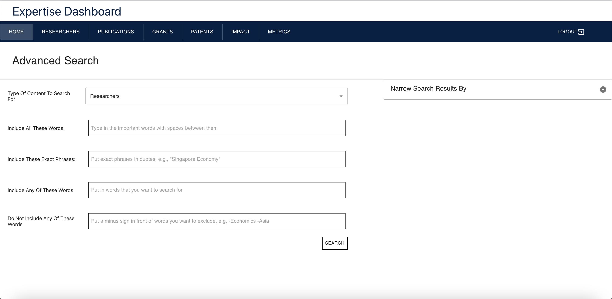

There are 4 possible advanced search fields.

1. Include All These Words

   - Separate each key word with a space character
   - eg. If you would like the words "Covid-19" and "pandemic" to both be included in your search results, enter `Covid-19 pandemic` into the text field.

2. Include These Exact Phrases

   - Enter the phrase you would like to search for in quotation marks
   - eg. If you would like a publication to include the phrase "Covid-19 Pandemic Effects", enter `"Covid-19 Pandemic Effects"` into the text field.

3. Include Any Of These Words

   - Separate each key word with a space character
   - eg. If any of the words "Covid-19", "pandemic", or "effects" can be included in your search results, enter `Covid-19 pandemic effects` into the text field.

4. Do Not Include Any Of These Words

   - Separate each key word that cannot be included with a minus (-) character
   - eg. If you do not want any of the words "Covid-19", "pandemic", or "effects" to be included in your search results, enter `-Covid-19 -pandemic -effects` into the text field.

 

Search results can also be refined by filtering researchers by department or by faculty. Publications can be filtered by year and by journal.
 

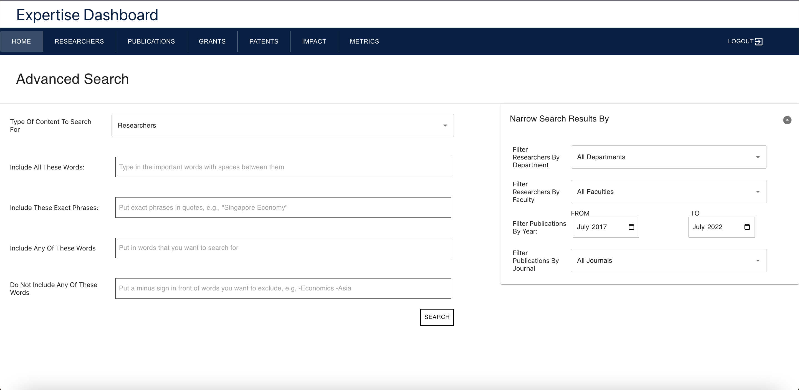

## Researcher Profile

The researcher profile page contains general information about a researcher, their publications/grants/patents, areas of interest and a list of similar researchers.

### General Information

The researcher's general information including name, faculty, department, email, phone number, office Scopus ID, and time last updated are displayed here.
 

### Researcher Highlights

Some of the researcher's highlights are displayed here, including their number of publications, H-index, funding and a graph displaying their number of publications each year for the past five years.

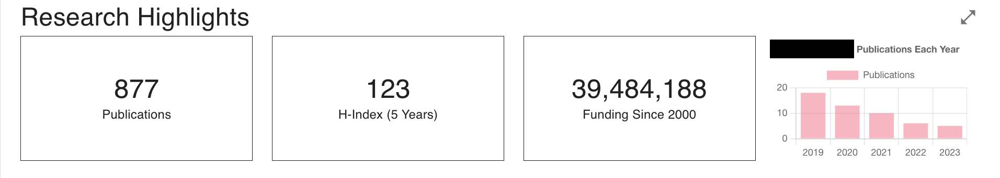

Clicking on the expand arrow icon on the smaller graph will display a graph below that shows the number of publications each year.

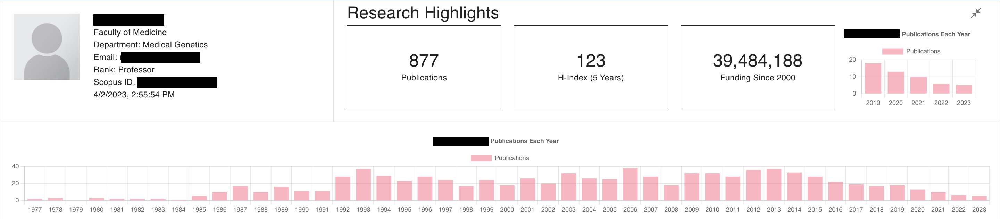

### Areas of Interest and Similar Researchers

This section displays a list of the researcher's areas of interest. The researcher's top five areas of interest are shown by default. To view all, click the `View All Areas of Interest` button.
 

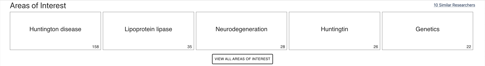

Clicking on each of the keyword box will show other researchers that has the same area of interest keyword.

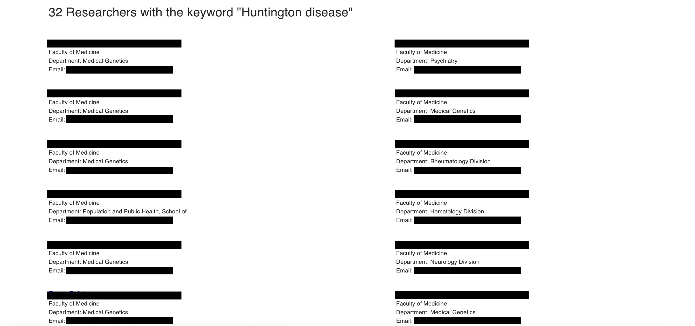

Clicking the `10 Similar Researchers` button will display a list of researchers that are in the same faculty, department, or have similar areas of interest.

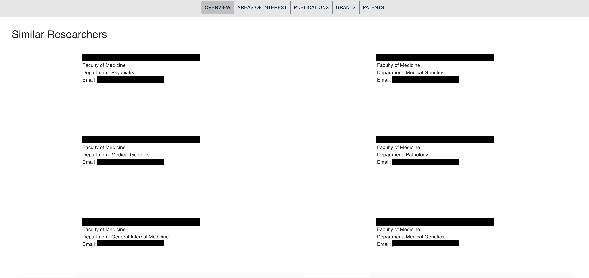

### Publications/Grants/Patents

The Publications section displays a list of the researcher's publications, along with information about the number of citations and the year published. Clicking on the publication title will open the publication on Scopus.

Hovering over the `Year Published` table column header display an arrow icon. Clicking on this arrow icon will sort the publications by year published starting from the most recent year. Similarly, overing over the `Title` table column header will display an arrow icon. Clicking on this arrow icon will show the list of publications in alphabetical order.

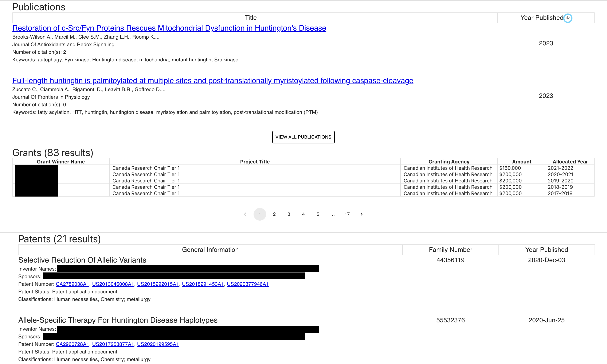

The Grants section displays a list of the researcher's awarded grants, along with information about the title of their projects, the name of the granting agency, the amount in dollars, and the allocation year.

The Patents section displays a list of the researcher's patents data, along with information about the title of the filed invention, the inventors’names, the sponsoring entities, the patent numbers, the patent status, the patent classifications, the patent family number and the year it was published. Clicking on one of the patent number will redirect to the corresponding published record on European Patent Office’s Espacenet website.

## Impact

The Impact tab displays a table with all researchers sorted by their H index for the past 5 years. Researcher impact can be filtered by department or by faculty by clicking on the `Impact By Faculty` or `Impact By Department` toggle tabs above the impacts table.
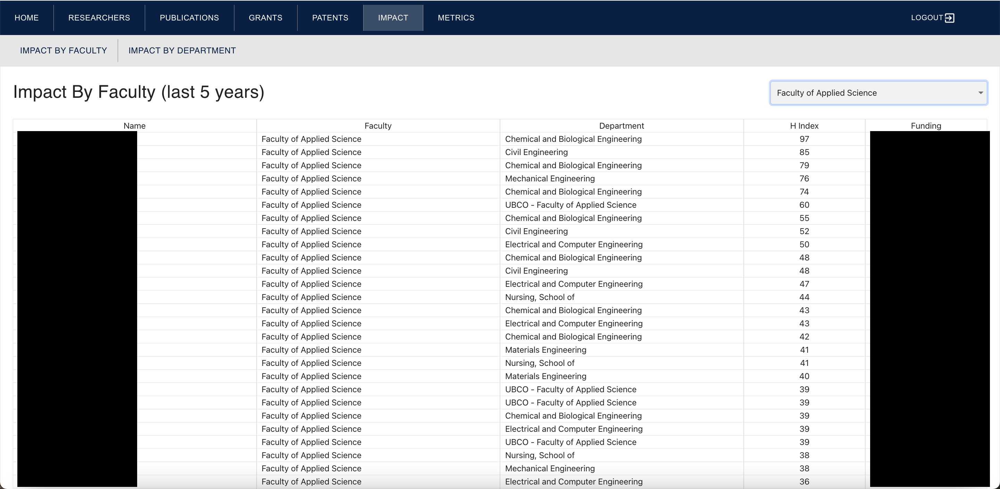

## Metrics

The Metrics tab displays a word cloud containing the top 100 keywords in the Institution's research during a user selected date range. The font size of each word in the word cloud corresponds to the frequency that that word has appeared in publication titles during the selected date range. The earliest available year is 1908, and the latest available year is the current year.

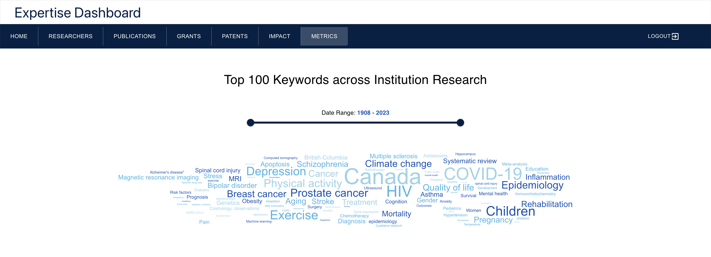

The selected date range can be changed by moving either one of the date range slider buttons. A new word cloud will then be formed with the words for the updated date range.

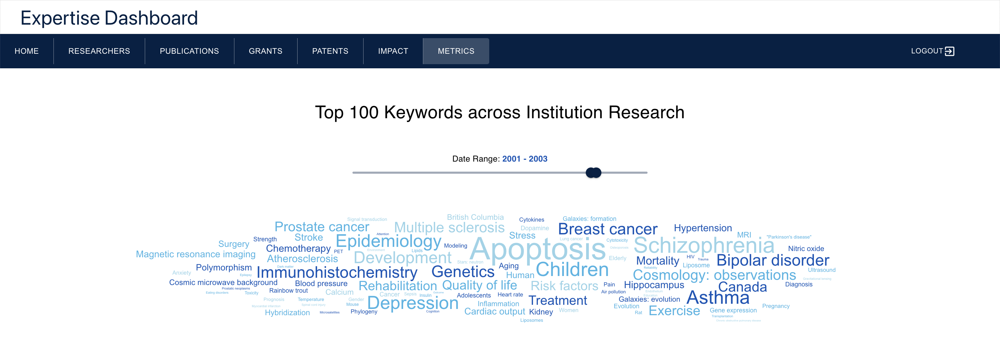

To view the exact number of times a certain keyword has appeared, hover over the word and a popup will appear. If you would like to search for that keyword, click the word to open a new tab containing the search results.
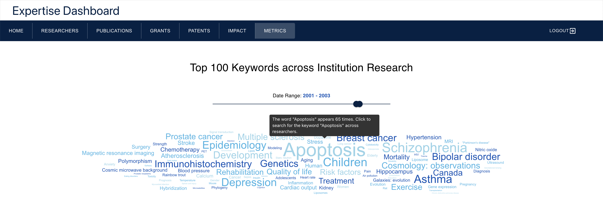

## Admin Dashboard

The admin dashboard page is only accessible by admin users. Once the user has logged in, this page is used for viewing logs of when data has been updated on the site, changing Scopus IDs of researchers on the site, and viewing any discrepancies in researcher entries.

The admin dashboard page contains three tabs.

### 1. Logs

The Logs tab contains two tables. The first table displays logs of the time at which publications are updated, as well as the number of publications that are updated.

The second table displays logs of the time at which researchres are updated, as well as the name of the researcher that are updated.

### 2. Change Scopus IDs

The Change Scopus IDs tab allows admin users to change the Scopus ID of any researcher. To change a Scopus Id, begin by entering the current researcher Scopus ID that you would like to change. Then click `Look Up Scopus ID`.

This will open a window displaying the information of the researcher associated with that Scopus ID. Enter the new Scopus ID in the text field beside `Input New Scopus ID:`. Then click the `Change Scopus ID` button on the lower right hand side of the window.

### 3. Flagged IDs

The flagged IDs tab displays researchers that have had their Scopus ID flagged. At the top of the page, there will be a message showing how many researchers there currently are with flagged IDs.

Below that, flagged researcher entries are grouped into tables with the columns containing Researcher Name, Scopus ID, Employee ID, Department, Faculty and Reason Flagged information.

## Updating Researchers

### Step 1: Upload Data to S3

1. Follow this [link](https://www.scival.com/overview/authors?uri=Institution/501036) to the Scival page for your Institution and sign in. Click on the `Export` dropdown menu then click `Download full list of authors (CSV)`. Rename the file to `scopus_ids.csv`.
   
2. Ensure you have a file containing researcher HR data. An example of how this file should be structured can be found here: [Example HR Data File](example_data/hr_data(example).csv). This file must be named `institution_data.csv`. Note that the `INSTITUTION_USER_ID` column could represents any types of **unique ids** (employee id from institution's HR data, uuid from the institution's external database, etc), and each ids must be associated with one person(researcher) only.
3. At the [AWS online console](https://console.aws.amazon.com/console/home), enter `S3` in the search bar.
   
4. In the `Buckets` search bar enter `datafetchstack` and click on the name of the bucket (the name also contain the string `datas3bucket`).
   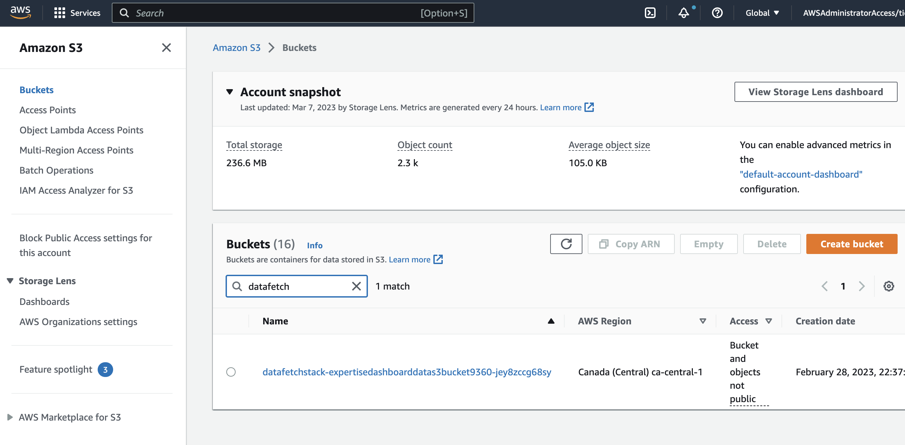
5. Click on the `researcher_data` folder.
   
6. Select the `institution_data.csv` and `scopus_ids.csv` files (also select the `manual_matches.csv` file if it is present) and click `Delete`
   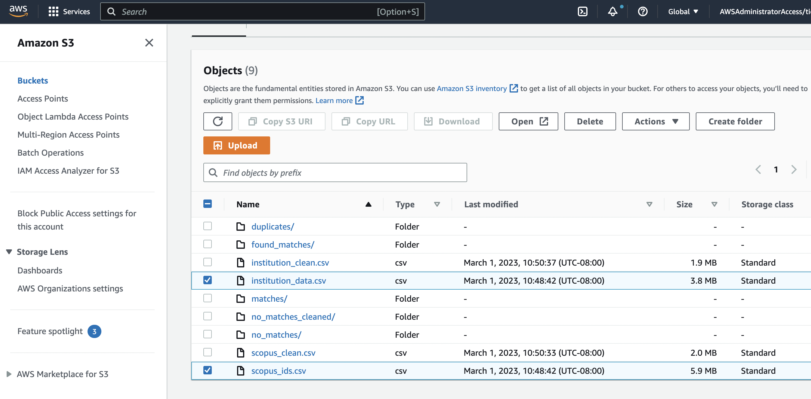
7. Type `permanently delete` in the text input field then click `Delete objects`.
   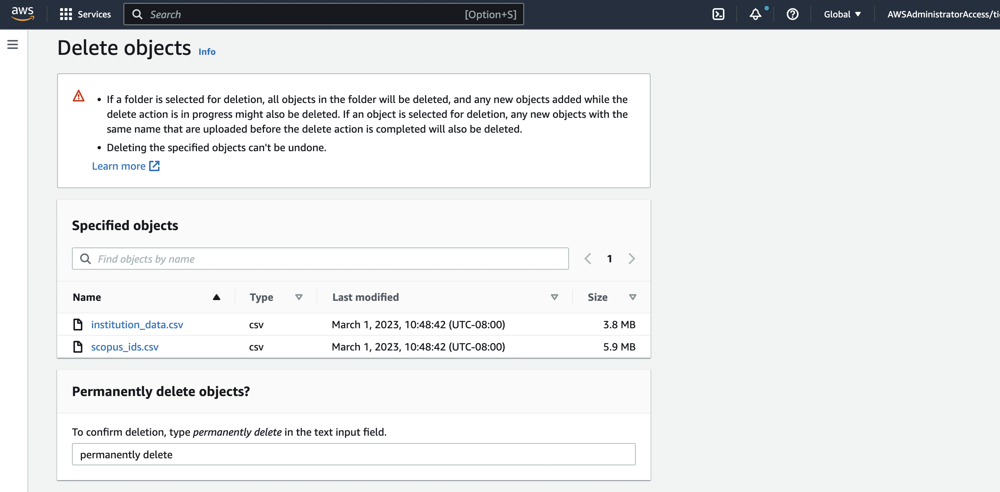
8. Click `Close` once the deletion is finished.
9. Click `Add Files` and select the `scopus_ids.csv` file from part 1 and the `institution_data.csv` file from part 2 (also if you have a file of manually matched researcher profiles upload them as well. The file must be named `manual_matches.csv` and should be structured like the following file: [Example Matches File](example_data/manual_matches(example).csv)) then click `Upload`.
   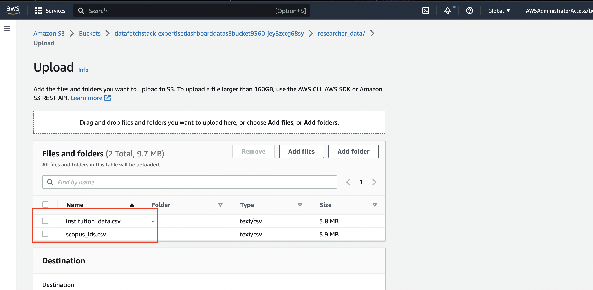
10. Once the upload is complete click `Close`

### Step 2: Run the Data Pipeline

1. At the [AWS online console](https://console.aws.amazon.com/console/home), enter `Step Functions` in the search bar.
   
2. In the State Machine search bar enter `DataFetchStateMachine` and click the name of the top result (The exact name of the state machine may vary but it will always contain the string `DataFetchStateMachine`.
   
3. Click `Start Execution`
   
4. In the box that appears click `Start Execution`. Do not edit the text in the input field.
   
5. The data pipeline will now run on its own and populate the database. This process will take ~5 hours. If you navigate to the page you visited in part 2 of this step you can view the status of the data pipeline. Once it is finished running the step function execution status will say `Succeeded`.
   

## Updating Grant Data

**NOTE**: grant data should be updated every 6 months or so.

1. Refer to the [User Guide to Grant Downloads](User%20Guide%20to%20Grant%20Downloads.pdf) for instructions on how to obtain the grant data for your institution.
2. At the [AWS online console](https://console.aws.amazon.com/console/home), enter `S3` in the search bar. Find the bucket whose name contains the string `grantdatas3` (the full name will have some random alpha-numeric letter after that initial identifier).
3. There is a folder called `raw` already created for you at deployment, and it contains 4 subfolders (`cihr`, `cfi`, `nserc`, `sshrc`). Inside each of the subfolder, delete the old csv file and replace it with the corresponding new CSV file for that grant there. For SSHRC, please also remember to include the `sshrc_program_codes.csv` file along with the SSHRC grant data CSV file. The resulting folder structure should look like this:
   

**NOTE**:

+ If you found out that you there was a mistake in the uploading process, either you put the wrong files in the wrong folders, or there were extra files uploaded accidentally, then you should **delete the wrong file** then **wait for 20 minutes and redo the uploading process**. 
+ In the extremely unlikely situation that you do not see the `raw` folder and its 4 subfolders automatically created during **first-time deployment**, you can also manually create the `raw` folder first, then the 4 subfolders inside.

4. If the uploading process was performed correctly, the Grant Data Pipeline will automatically be invoked and the new data will show up in the RDS PostgreSQL database after around 20 min or so.

5.  After around 20 minutes, navigate to the S3 bucket that you uploaded the grant earlier. If you're still having that page open, simply refresh the page. If this Grant Data Pipeline has successfully executed, you should see another 2 folders being added (**clean** and **ids-assigned**) in addition to your **raw** folder.
   

6.  By going into those 2 new folders, you should see that they have a **similar subfolder structure to raw**. You dont have to do anything further.
   
   

7.  If you see that a folder(s) is missing. Please wait for another 10 or so minutes because this could be a latency issue. If you came back and check and that missing folder still has not show up, then it is possible that a wrong file was uploaded in **raw** folder. Please double check your **raw** folder and follow the instructions above to reupload accordingly.

## Updating Patent Data

You only need to manually execute the Patent Data Pipeline for first time deployment. Subsequent runs will be automatically scheduled and executed on day 1st and 15th of every month (twice a month).

You could also manually execute the pipeline if you wish. Refer to [Step 7](DeploymentGuide.md/#step-7-starting-patent-data-pipeline) for detail on how to manually run the pipeline.