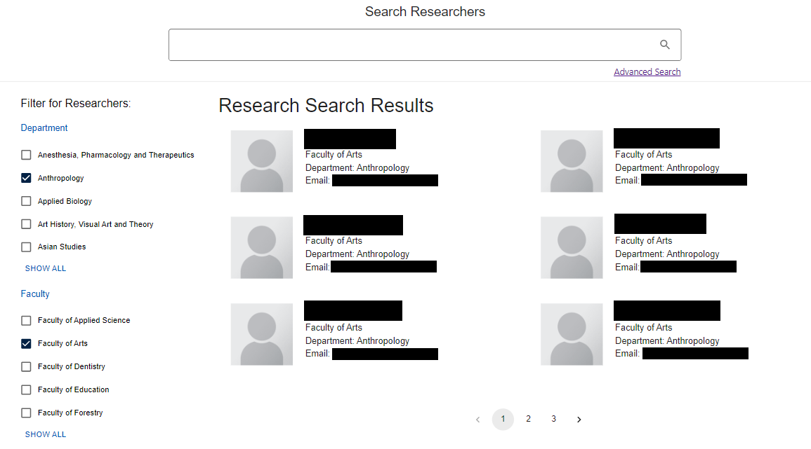
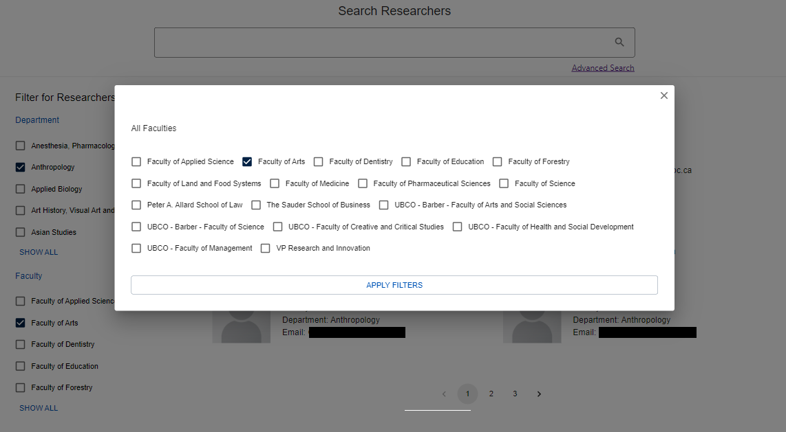
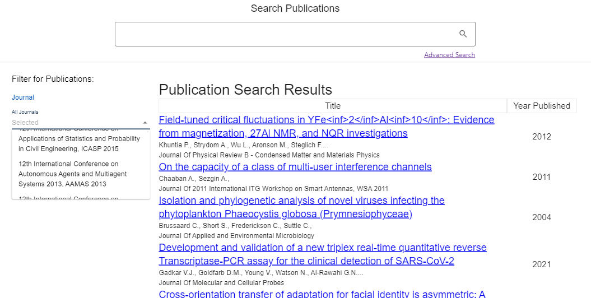
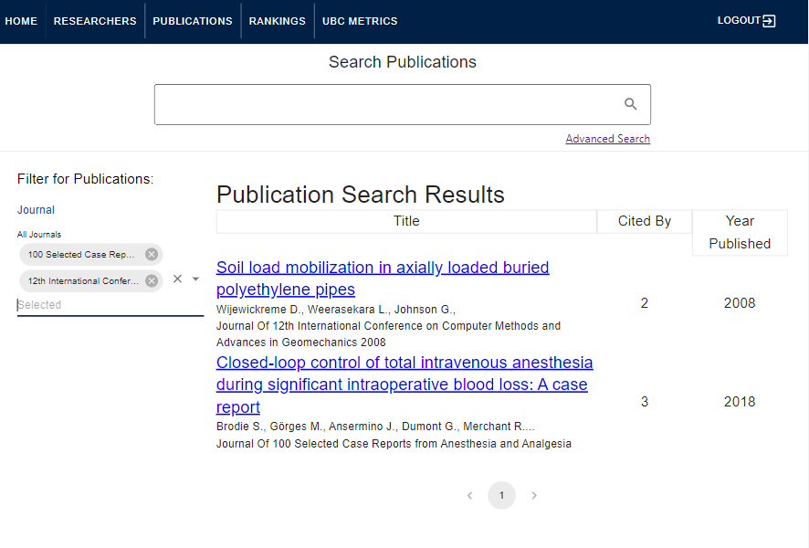
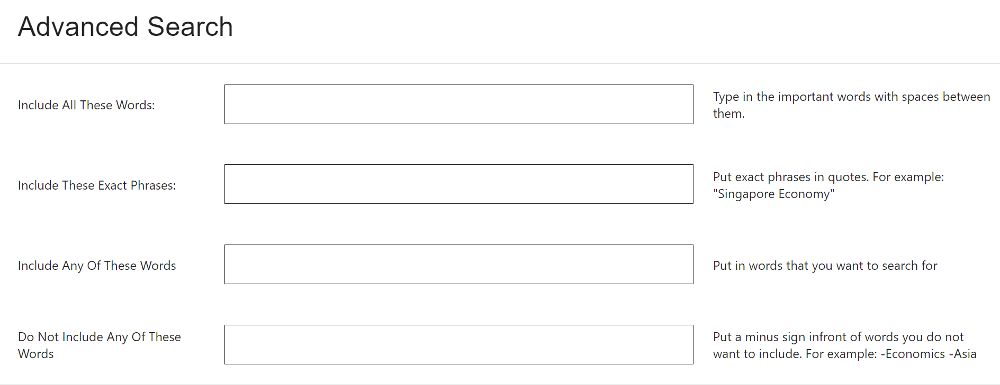
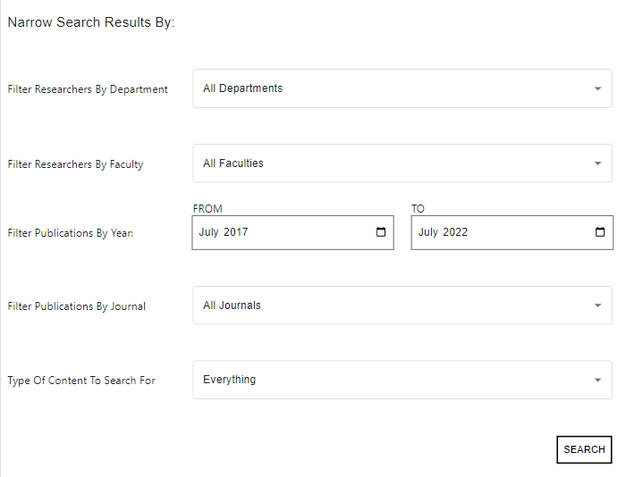
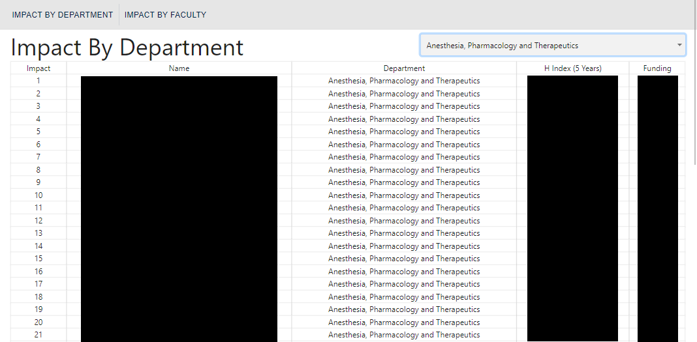
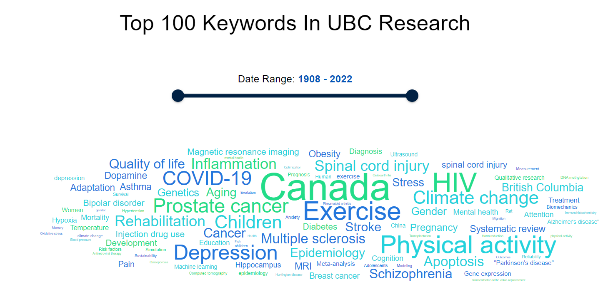
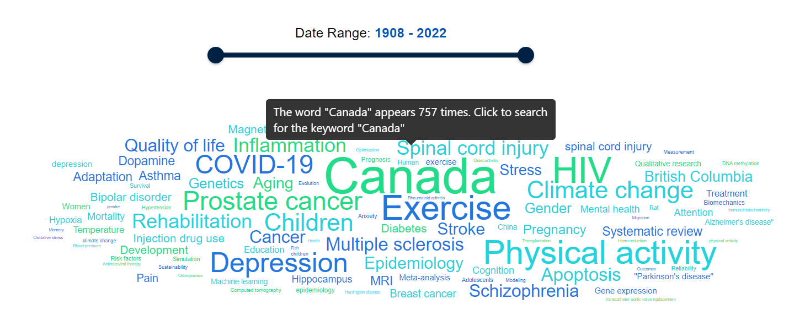

# User Guide

**Before Continuing with this User Guide, please make sure you have deployed the frontend and backend stacks.**

- [Deployment Guides](./DeploymentGuide.md)

| Index                                       | Description                                  |
| :------------------------------------------ | :------------------------------------------- |
| [Home](#Home)                               | Main search bar (Search Everything)          |
| [Researchers Search](#Researchers-Search)   | Researcher search and related filters        |
| [Publications Search](#Publications-Search) | Publications search and related filters      |
| [Advanced Search](#Advanced-Search)         | Advanced search                              |
| [Rankings](#Rankings)                       | Researcher rankings by department or faculty |
| [Metrics](#Metrics)                         | Top 100 research keywords word cloud         |

## Home

<<<<<<< HEAD
The Home page contains a search bar that will return both researcher and publication results that match the user inputted search term. Researcher results are displayed on the top section of the home page, and publication results are displayed below. More details on the researcher and publication search components can be found in the sections [Researchers Search](#Researchers-Search) and [Publications Search](#Publications-Search).
=======
The Home page contains a search bar that will return both researcher and publication results that match the user-inputted search term. Researcher results are displayed on the top section of the home page, and publication results are displayed below. More details on the researcher and publication search components can be found in the sections [Researchers Search](#Researchers-Search) and [Publications Search](#Publications-Search).
>>>>>>> d8309cef58256ab5b06de48a37797fb1c4917f09

## Researchers Search

The search bar on this page returns researcher results that match the user inputted search term. Filters for researchers can be found on the left hand sidebar. There are 2 categories to filter by (Department, Faculty).

<<<<<<< HEAD
Clicking on the `Show All` button will open a modal displaying all the possible options for the filter category. To select the options you would like to filter by, click the checkbox beside the option name. Then click `Apply Filters`. Multiple filter options can be selected from both the Department and Faculty category.
=======
Clicking on the `Show All` button will open a window displaying all the possible options for the filter category. To select the options you would like to filter by, click the checkbox beside the option name. Then click `Apply Filters`. Multiple filter options can be selected from both the Department and Faculty category.
>>>>>>> d8309cef58256ab5b06de48a37797fb1c4917f09

## Publications Search

<<<<<<< HEAD
The filter for publications can be found on the left hand sidebar. There is 1 category to filter by (Journal). Clicking on the `All Journals` tab will open a dropdown displaying all the possible journal options.
=======
The filter for publications can be found on the left hand sidebar. There is one category to filter by (Journal). Clicking on the `All Journals` tab will open a dropdown displaying all the possible journal options.
>>>>>>> d8309cef58256ab5b06de48a37797fb1c4917f09

To select the journal options you would like to filter by, click the journal name and the selected journal will appear above the dropdown menu.

## Advanced Search

The advanced search page can be accessed by clicking the `Advanced Search` button underneath the search bar in either the Home tab (will return results for both researchers and publications), Researchers tab (will only return results for researchers) or Publications tab (will only return results for publications).

There are 4 possible advanced search fields.

1. Include All These Words

   - Separate each key word with a space character
   - eg. If you would like the words "Covid-19" and "pandemic" to both be included in your search results, enter `Covid-19 pandemic` into the text field.

2. Include These Exact Phrases

   - Enter the phrase you would like to search for in quotation marks
   - eg. If you would like a publication to include the phrase "Covid-19 Pandemic Effects", enter `"Covid-19 Pandemic Effects"` into the text field.

3. Include Any Of These Words

   - Separate each key word with a space character
   - eg. If any of the words "Covid-19", "pandemic", or "effects" can be included in your search results, enter `Covid-19 pandemic effects` into the text field.

4. Do Not Include Any Of These Words

   - Separate each key word that cannot be included with a minus (-) character
   - eg. If you do not want any of the words "Covid-19", "pandemic", or "effects" to be included in your search results, enter `-Covid-19 -pandemic -effects` into the text field.

 

Search results can also be refined by filtering researchers by department or by faculty. Publications can be filtered by year and by journal.
 

## Rankings

The Rankings tab displays a table with all researchers ranked by their H index for the past 5 years. Rankings can be filtered by department or by faculty by clicking on the `Rank By Department` or `Rank By Faculty` toggle tabs above the rankings table.

## Metrics

The Metrics tab displays a word cloud containing the top 100 keywords in UBC research during a user selected date range. The font size of each word in the word cloud corresponds to the frequency that that word has appeared in publication titles during the selected date range. The selected date range can be changed by moving either one of the date range slider buttons. A new word cloud will then be formed with the words for the updated date range. The earliest available year is 1908, and the latest available year is the current year.

To view the exact number of times a certain keyword has appeared, hover over the word and a popup will appear. If you would like to search for that keyword, click the word to open a new tab containing the search results.

